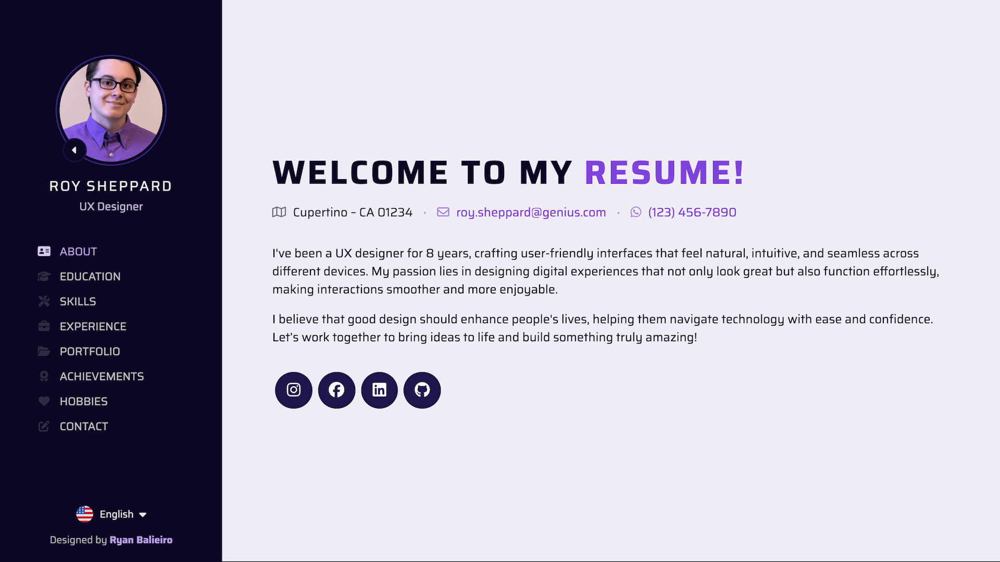
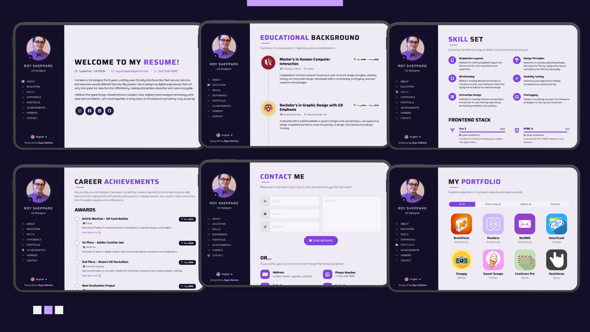
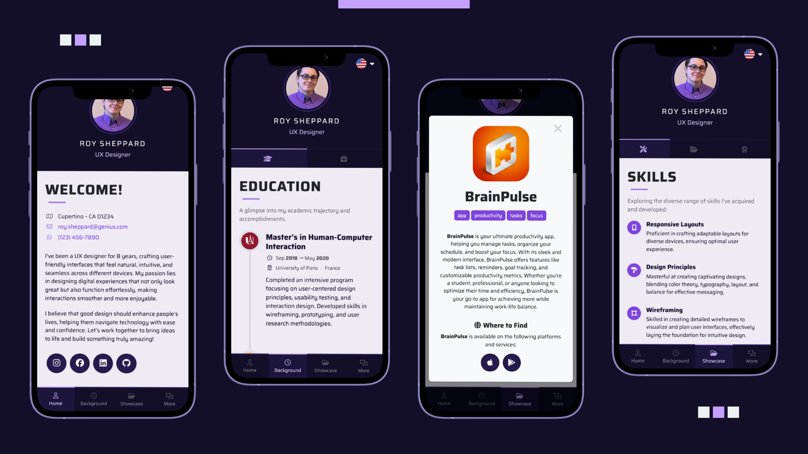

#  [Vue Resume Template](https://ryanbalieiro.github.io/vue-resume-template/) by Ryan Balieiro

A clean and minimal template for building a resume landing page, powered by **Vue 3** (Composition API) and **Bootstrap 5**.


Key features:
- Uses Vue3 **Composition API**.
- **Six unique section layouts** to showcase your work experience, education, skills, projects, and more.
- Adaptive navigation: **a fixed sidebar** for desktops and **a tabbed layout** for mobile.
- Built-in **multi-language** support.
- Emails with **EmailJS** – no backend needed!
- **Super easy** to customize!

## Live Preview

Check out a live version of the template **[here](https://ryanbalieiro.github.io/vue-resume-template/).**

### 1. Base layout
The theme has a clean, minimalist design with a nice mix of purple shades that gives it a fresh, stylish vibe.



### 2. Desktop Screenshots
On desktop, it has a simple one-page layout with a fixed sidebar, so users can easily scroll through the sections.



### 3. Mobile Screenshots
On mobile, the layout groups the sections into categories and transforms into a tabbed interface with a bottom navigation.



## Getting Started

1. Clone the repo:
```
git clone https://github.com/ryanbalieiro/vue-resume-template
```

2. Go to the project's root folder and use npm to install all required components:
```
npm install
```

3. Launch the project in developer mode:
```
npm run dev
```

4. (Optional) If you'd like to clear all the portfolio data and begin with a blank page with no sections, run the command below:
```
npm run resume:clear
```

5. (Optional) If you want to temporarily deactivate the preload animation during theme adjustments, go to `public/data/settings.json` and set the `preloaderEnabled` flag to false.

## Template Customization

### 1. Quickly customizing the colors

You can easily customize the theme colors to match your style. Just head to `src/scss/_variables.scss` and tweak the color variables. For example, if you want your resume to have a blue theme instead of purple:

```scss
$primary: #0988a2; /** making the primary color blue **/
$loader-background: #0b4e5d; /** making the loading screen background blue **/
$nav-background: #032f38; /** changing the nav items to dark blue **/
```

### 2. Changing the content

All portfolio content, including texts and images, is located in the public folder at the root level. Within this folder, you'll find two key directories:

- `public/data` ➔ Contains JSON files with the portfolio's texts and general configurations.
- `public/images` ➔ Contains all the images used in the portfolio.

To customize the content of the portfolio, simply edit the JSON files and swap out the images as needed. It's that easy!

### 3. Adding and removing languages

To add or remove languages, open `public/data/settings.json` and modify the `supportedLanguages` field as needed. Use the `default` property to specify the fallback language that should be used if the application doesn't support the user's preferred language.

```json
{
    "supportedLanguages": [
        {
            "name": "English",
            "id": "en",
            "flagUrl": "images/flags/en.png",
            "default": true
        },

        {
            "name": "日本語",
            "id": "ja",
            "flagUrl": "images/flags/ja.png"
        }
    ]
}
```

The `public/images/flags/` folder already contains a collection of flags for commonly used languages. If you require a specific flag icon that isn't there, you can download it [here](https://www.flaticon.com/packs/countrys-flags) for free.

To **deactivate support** for multiple languages, keep only a single language within the array. This will automatically hide the language picker menu.

### 4. Adding, removing, and reordering sections

Adding, removing or reordering the sections can be achieved by making modifications to the `sections` array inside `public/data/sections.json`:

```json
{
    "sections": [
        {
            "id": "about",
            "categoryId": "home",
            "jsonPath": "/sections/cover.json",
            "faIcon": "fa-solid fa-address-card",
            "type": "centered",
            "locales": {
                "en": {
                    "title": "Welcome to my *resume!*",
                    "title_short": "Welcome!",
                    "description": null,
                    "nav_label": "About"
                }
            }
        }
    ]
}
```
Each section entry comprises the following fields:

| Field      | Description                                                                                                 |  
|------------|-------------------------------------------------------------------------------------------------------------|
| id         | A unique identifier for the section.                                                                        |
| categoryId | Specifies the category to which the section belongs (used for grouping sections in the mobile navigation).  |
| jsonPath   | Path to the file containing the section's content.                                                          | 
| faIcon     | The FontAwesome icon for this section, used to customize its link in the navigation components.             |
| type       | Specifies the section's layout style, which can be `centered`, `row`, or `column`.                          |                                                                   

The `locales` field can include the following entries:

| Field          | Required? | Description                                                      |
|----------------|-----------|------------------------------------------------------------------|
| title          | YES       | The main title of the section.                                   |
| title_short    | NO        | A condensed version of the main title, used for smaller screens. |
| description    | NO        | A text that will be displayed below the section title.           |
| nav_label      | YES       | The label for the section link in the navigation menu.           |

### 5. Categories

The resume sections are organized into categories, which are used to generate the grouped tab navigation for mobile screens. To add, edit, or remove categories, open `data/sections/categories.json` and make the desired changes.

### 6. Editing the section content

You can customize a section's content by editing its corresponding JSON file. Each section in the app is made up of a set of articles, which are generic components used to display blocks of information. These components render the section along with its respective content.

```json
{
    "articles": [
        {
            "id": 1,
            "component": "ArticleTimeline",
            "locales": {},
            "settings": {
                "order_items_by": "id",
                "order_items_sort": "asc"
            },

            "items": []
        },

        {
            "id": 2,
            "component": "ArticleSkills",
            "locales": {},
            "settings": {
                "order_items_by": "id",
                "order_items_sort": "asc"
            },

            "items": []
        }
    ]
}
```

Each article should have a unique ID, a component name, a settings object, and an array of items. Since each article requires different settings and item structures, refer to the existing examples to understand how to properly build each section.

List of available article types:

| Component             | Description                                                       |
|-----------------------|-------------------------------------------------------------------|
| ArticleContactForm    | Displays a contact form that allows users to send a message.      |
| ArticleContactOptions | Shows a list of available contact options.                        |
| ArticlePortfolio      | Renders a clickable gallery of projects.                          |
| ArticleProfile        | Displays a profile card with a bio and social links.              |
| ArticleSkills         | Presents a dynamic list of skills or strengths in short snippets. |
| ArticleThread         | Displays a thread of events or posts.                             |
| ArticleTimeline       | Shows a timeline with images, descriptions, and dates.            |

### 7. Localizing texts

Place your translations for **static texts** in `public/data/strings.json`. This file serves as a central hub for all your global localization needs, making your translations accessible via the injectable method `localizeFromStrings`:

```js
const localizeFromStrings = inject("localizeFromStrings")
const translation = localizeFromStrings("name")
console.log(translation) // Will print "Nome" (en) or "Nombre" (es)
```

For translations specific to sections, you can create a custom `locales` field inside each article or article item:
```json
{
    "articles": [
        {
            "id": 1,
            "component": "ArticleSkills",
            "locales": {
                "en": { "hello": "Hello!" },
                "es": { "hello": "Hola!" }
            }
        }
    ]
}
```

And then, use the following injectable function to fetch the translation:

```js
const localize = inject("localize")
const translation = localize(section.articles[0].locales, "hello")
console.log(translation) // Will print "Hello!" (en) or "Hola!" (es)
```

### 8. Contact form configuration

The contact form component integrates `EmailJS`. EmailJS is a free service that allows you to send emails using JavaScript - without the need for a backend.

To configure your contact form, follow these steps:

- Create an EmailJS account (https://www.emailjs.com/)
- In your EmailJS account panel, create an email service, which configures the provider that will send the emails (e.g., your Gmail or iCloud account).
- Next, on your dashboard, create a new email template like this one:

```
You got a new message from {{from_name}} ({{from_email}}):

Subject: {{custom_subject}}

{{message}}
```

- Now, open `public/data/sections/contact.json` in your project and fill in the `settings` dictionary with your account info:

```json
{
    "settings": {
        "contact_js_public_key": "YOUR_EMAIL_JS_PUBLIC_KEY",
        "contact_js_service_id": "YOUR_EMAIL_JS_SERVICE_ID",
        "contact_js_template_id": "YOUR_EMAIL_JS_TEMPLATE_ID"
    }
}
```

- And voilà! Now you can submit your first email!

## Deployment

### 1. Vite configuration
Open `vite.config.js` and set the base directory for your application. This setting defines the main path that your website will be hosted under.

```js
export default defineConfig({
  base: '/vue-resume-template/',
  plugins: [vue()],
})
```

In simple terms, if you consider GitHub hosting the GitHub Pages site for this repo at the URL `https://ryanbalieiro.github.io/vue-resume-template/`, the correct base directory to set is `/vue-resume-template/`.

If you're deploying to Netlify or your own custom domain where your website is located at the root, you can leave the `base` setting as `'/'`.

### 2. Building for production
To compile your project for production, execute:

```
npm run build
``` 

This command triggers a series of processes that package your code, assets, and other necessary files, ultimately creating a production-ready version of your project. After running the command, you'll find the compiled files within the `dist` folder.

## About

This template was created by and is maintained by **[Ryan Balieiro](https://ryanbalieiro.com/)**.

It is based on the [Bootstrap](https://getbootstrap.com/) framework created by Mark Otto and Jacob Thorton; and the [Vue](https://vuejs.org/) framework created by Evan You.

Additional frameworks and plugins used include:
- **Font Awesome**: A library of free vector icons.
- **EmailJS**: A free service that allows you to send emails using JavaScript.
## Copyright and License

Code released under the [MIT](https://opensource.org/license/mit) license, providing complete freedom for utilization. Feel free to enhance and adapt it to suit your needs.

Oh... and if you like this template, don't forget to **give it a ⭐** :)